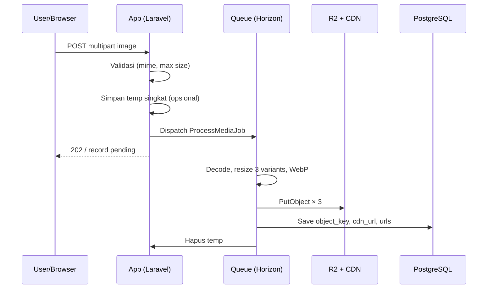

# CDN & Media

> Strategi penyimpanan media user via Cloudflare R2 + CDN.
> Acuan: [blueprint.md](../blueprint.md) · [schema.md](../database/schema.md)

---

## Prinsip

1. **Semua file user** (gambar produk, logo, banner, review, PDF digital product) → object storage + CDN  
2. **Database hanya menyimpan** `object_key`, `cdn_url` (dan metadata) — **bukan** binary  
3. **Jangan** simpan file user permanen di `storage/app` production atau di git  
4. Repo/`resources` hanya untuk **asset UI** kecil (icon, font)

---

## Stack

| Layer | Pilihan |
|-------|---------|
| Object storage | Cloudflare R2 (S3-compatible) |
| CDN | Cloudflare (custom domain bucket / R2 public URL) |
| Optimize | Queue job + Intervention Image / spatie |
| Format output | WebP (+ fallback JPEG jika perlu) |

Disk Laravel: `s3` atau `r2` di `config/filesystems.php`.

---

## Image variants

Setiap upload gambar menghasilkan **3 ukuran**:

| Variant | Max width | Dipakai untuk |
|---------|-----------|---------------|
| `thumbnail` | 150px | List, cart, admin table |
| `medium` | 600px | Kartu produk, OG fallback |
| `large` | 1200px | Detail produk, zoom ringan |

Orientasi: resize **maintain aspect ratio**, jangan upscale berlebihan.

---

## Naming / object key

### Pattern

```
{tenant_id}/{collection}/{entity_id}/{uuid}_{variant}.webp
```

### Contoh

```
a1b2c3d4-.../products/e5f6-.../9f8e7d6c_thumbnail.webp
a1b2c3d4-.../products/e5f6-.../9f8e7d6c_medium.webp
a1b2c3d4-.../products/e5f6-.../9f8e7d6c_large.webp

a1b2c3d4-.../stores/logo/9f8e7d6c_medium.webp
a1b2c3d4-.../reviews/ord-item-.../9f8e7d6c_thumbnail.webp
a1b2c3d4-.../digital/prod-.../file.pdf
```

### Collection values

| collection | Isi |
|------------|-----|
| `products` | Gambar produk |
| `stores` | Logo, banner toko |
| `reviews` | Foto review |
| `cms` | Hero, banner landing |
| `blog` | Cover post |
| `digital` | File produk digital (bisa private/signed URL) |
| `misc` | Lainnya |

**Jangan** pakai nama file original user di path (aman + unik → UUID).

---

## URL publik

```
https://cdn.platform.com/{object_key}
```

atau R2 public bucket URL.

DB menyimpan:

| Field | Contoh |
|-------|--------|
| `object_key` | `tenant/.../uuid_large.webp` |
| `cdn_url` | full URL ke variant utama (biasanya `large` atau `medium`) |
| `urls` (json) | `{ "thumbnail": "...", "medium": "...", "large": "..." }` |
| `mime_type` | `image/webp` |
| `size` | bytes file original / large |

Frontend **selalu** pakai CDN URL dari props/DB — jangan `asset()` atau Vite untuk gambar user.

---

## Upload flow



### Validasi upload (gambar)

| Rule | Saran MVP |
|------|-----------|
| MIME | jpeg, png, webp |
| Max size | 5 MB (produk), 2 MB (avatar/logo) |
| Max dimension | reject / downscale jika > 4000px |

### Private files (digital product, bukti transfer)

- Bucket private atau prefix private  
- Akses via **signed URL** berwaktu  
- Jangan expose public CDN tanpa auth

---

## Yang boleh lokal (sementara)

| Situasi | Boleh? |
|---------|--------|
| Temp file sebelum job selesai | Ya, hapus setelah upload R2 |
| Local disk di `local` env tanpa R2 | Dev only — jangan production |
| Failed job retry | Temp boleh; jangan orphan selamanya |

---

## Lifecycle & kebersihan

- Hapus object R2 saat product image dihapus (job `DeleteMediaJob`)  
- Ganti logo: upload baru + hapus object lama  
- Orphan detection (opsional Phase 2): object tanpa row DB

---

## Env keys (tanpa secret di git)

```
FILESYSTEM_DISK=s3
AWS_ACCESS_KEY_ID=
AWS_SECRET_ACCESS_KEY=
AWS_DEFAULT_REGION=auto
AWS_BUCKET=
AWS_ENDPOINT=https://xxxx.r2.cloudflarestorage.com
AWS_URL=https://cdn.platform.com
AWS_USE_PATH_STYLE_ENDPOINT=true
```

Isi ke `.env.example` sebagai placeholder (task P0-034).

---

## Checklist implementasi

- [ ] Disk R2 configured + test put/get  
- [ ] Job resize → 3 variants → upload  
- [ ] Model/media table simpan URL saja  
- [ ] Storefront load dari `cdn_url` / `urls.medium`  
- [ ] Delete sync ke R2  

---

## Anti-pattern (jangan)

- Commit folder `uploads/` berisi foto produk  
- Simpan path `storage/app/public/...` sebagai URL production  
- Serve gambar user lewat `php artisan serve` / symlink public tanpa CDN  
- Pakai satu ukuran original 5MB di list produk
