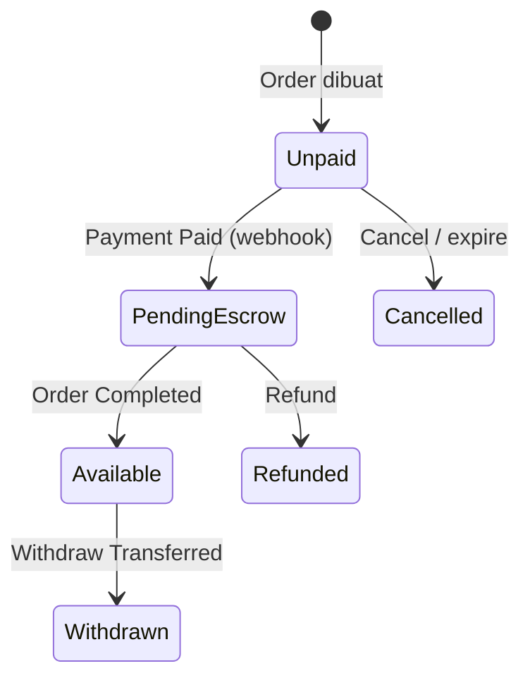

# Money Flow

> Alur uang Free Plan (escrow) vs Premium (direct settlement).
> Acuan: [schema.md](../database/schema.md) · [blueprint.md](../blueprint.md)

---

## Ringkasan bisnis

| | Free | Premium (Rp99.000/bulan) |
|---|------|---------------------------|
| Settlement | Escrow di platform | Direct ke rekening seller |
| Withdraw fee | **Rp5.000** / request | **Rp0** |
| Wallet | Ya — pending + available | Opsional / tracking; settlement utama langsung |

---

## State uang (Free Plan — escrow)



| State | Di sistem | Arti |
|-------|-----------|------|
| Unpaid | Order `Pending` | Belum ada uang |
| PendingEscrow | `wallets.pending_balance` ↑ | Sudah bayar, belum bisa ditarik |
| Available | `wallets.balance` ↑, pending ↓ | Bisa withdraw |
| Withdrawn | Withdraw `Transferred` | Sudah cair ke rekening |
| Refunded | Reversal ledger | Uang dikembalikan buyer |

---

## Free Plan — alur detail

```
Customer bayar (Midtrans)
        ↓
Payment status = paid
        ↓
Order status = Paid
        ↓
Credit wallet.pending_balance  (+ order total seller share)
        ↓
Seller proses → Order Completed
        ↓
Move pending → balance
        ↓
Seller request Withdraw
        ↓
Fee Rp5.000 dipotong
        ↓
Admin approve → transfer bank → status Transferred
```

### Kapan pending → available?

**Saat order status menjadi `Completed`** (bukan saat Paid).

Alasan: kurangi risiko refund / cancel setelah bayar tapi sebelum selesai.

(Jika nanti ada hold period, bisa ditambah delay N hari — MVP: langsung saat Completed.)

---

## Premium — direct settlement

```
Customer bayar
        ↓
Payment paid (webhook)
        ↓
Order = Paid
        ↓
Trigger settlement ke rekening seller (via gateway / payout)
        ↓
SKIP escrow wallet (atau catat ledger informational saja)
```

- Withdraw fee = **0**
- Seller tidak menunggu “Completed → balance → withdraw” untuk dana utama
- Implementasi payout mengikuti kemampuan Midtrans/Xendit (dokumentasikan di task P1-082)

---

## Wallet ledger

### Aturan emas

1. **Jangan** update `balance` / `pending_balance` tanpa baris `wallet_transactions`
2. Ledger **immutable** — tidak di-edit/hapus; koreksi pakai transaksi baru (reversal)
3. Setiap transaksi catat `balance_after` dan `pending_after`

### Tipe transaksi (`wallet_transactions.type`)

| Type | Direction | Efek |
|------|-----------|------|
| `order_escrow` | credit | `pending_balance` + |
| `order_release` | — | `pending` −, `balance` + (atau 2 baris debit pending + credit available) |
| `order_refund` | debit | Kurangi pending atau balance sesuai state |
| `withdraw_hold` | debit | `balance` − (saat request Pending) |
| `withdraw_fee` | debit | Potong fee dari balance / dari amount |
| `withdraw_release` | credit | Kembalikan hold jika Rejected |
| `withdraw_paid` | — | Konfirmasi transfer (opsional log) |
| `adjustment` | credit/debit | Koreksi admin (jarang) |

Rekomendasi implementasi `order_release`: **dua baris ledger** dalam satu DB transaction:

1. Debit pending (`order_release_pending`)
2. Credit available (`order_release_available`)

---

## Withdraw

### Status

```
Pending → Approved → Transferred
    ↘ Rejected
```

### Fee

```
Free:    net_amount = amount - 5000
Premium: net_amount = amount - 0
```

Validasi:

- `amount` ≤ `wallets.balance`
- `amount` > fee (Free: minimal > 5000)
- Saat create request: **hold** saldo (`balance` berkurang / locked) supaya tidak double withdraw

### Contoh angka (Free)

Order total yang masuk ke seller: **Rp100.000**

| Event | pending | balance |
|-------|---------|---------|
| Awal | 0 | 0 |
| Paid (escrow) | 100.000 | 0 |
| Order Completed | 0 | 100.000 |
| Withdraw request 100.000 | 0 | 0 (hold) |
| Fee | — | fee tercatat 5.000 |
| Transferred ke rekening | — | seller terima **Rp95.000** |

Jika withdraw **Rp50.000** dari balance 100.000:

- Fee: 5.000  
- Net transfer: **45.000**  
- Sisa balance setelah hold + fee accounting: **50.000** (tergantung apakah fee diambil dari amount atau dari sisa — **keputusan: fee diambil dari amount withdraw**, jadi seller minta 50.000 → dapat 45.000, balance berkurang 50.000)

---

## Order Paid — pembagian (MVP)

MVP sederhana:

- **100% `orders.total` (setelah diskon, sebelum/ sesudah ongkir — tentukan konsisten)** masuk pending escrow seller  
- Platform fee marketplace **belum** dipotong (kecuali withdraw fee)

Catat keputusan di code:

> Escrow amount = `order.total - shipping_cost` (ongkir opsional diteruskan ke kurir)  
> Atau escrow = seluruh `total` jika shipping dikelola seller.

Dokumentasikan pilihan final di implementasi P1-061.

---

## Idempotency

| Event | Kunci |
|-------|-------|
| Payment webhook | `payments.idempotency_key` / `external_id` |
| Escrow credit | Jangan double credit untuk `order_id` yang sama |
| Release pending | Hanya sekali per order completed |
| Withdraw | Satu active Pending per request; validasi balance atomik (DB transaction + lock) |

---

## Ringkasan untuk executor

1. Free = escrow di `pending_balance` → `balance` on Completed → withdraw − Rp5.000  
2. Premium = direct settlement, no withdraw fee  
3. Semua gerakan uang = baris ledger  
4. Webhook & release harus idempotent  

Detail tabel: [schema.md](../database/schema.md) bagian wallets / withdrawals.
