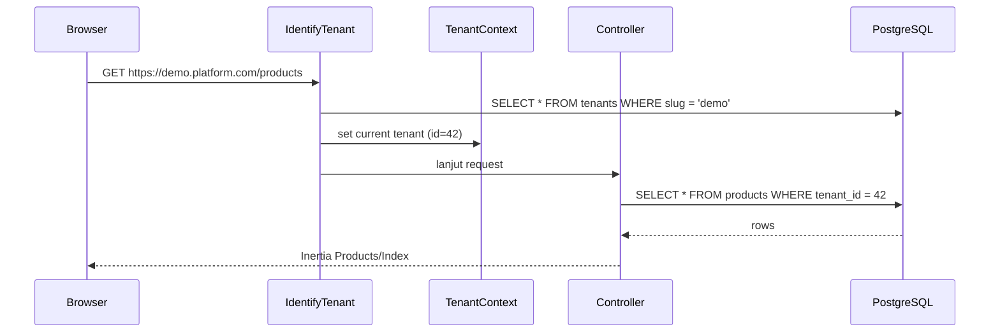

# Multi-Tenant Strategy

> Keputusan arsitektur tenancy untuk SaaS Toko Instan.
> Acuan: [blueprint.md](../blueprint.md)

---

## Overview

Platform ini multi-tenant: setiap seller punya **1 tenant = 1 toko**.

**MVP (Phase 0–1):** storefront publik diidentifikasi lewat **path slug**:

```
platform.com/{store_slug}  →  toko tersebut
```

**Nanti:** subdomain `{slug}.platform.com` dan custom domain Premium (Phase 2–3). Middleware `IdentifyTenant` sudah siap untuk resolusi subdomain opsional.

---

## Keputusan: Single Database + `tenant_id`

### Yang dipilih


| Aspek        | Keputusan                                    |
| ------------ | -------------------------------------------- |
| Database     | **1 PostgreSQL database** untuk semua tenant |
| Isolasi      | Kolom `tenant_id` di setiap tabel bisnis     |
| Query filter | Laravel Global Scope + middleware            |
| Schema PG    | `public` (bisnis), `audit`, `logs`           |


### Kenapa bukan DB / schema per tenant?


| Opsi                      | Alasan ditolak (tim kecil)                          |
| ------------------------- | --------------------------------------------------- |
| Database per tenant       | Migrasi & backup rumit, connection pool mahal       |
| Schema per tenant         | Migrasi masih berat, tooling lebih kompleks         |
| **Single DB + tenant_id** | Simpel, 1 migration set, cukup sampai ribuan tenant |


Keputusan ini bisa dievaluasi ulang di Phase 4 jika scale butuh isolasi lebih kuat.

---


## Identifikasi Tenant


### Sumber identitas

1. **Path slug (utama, MVP)** — route `/{store_slug}` / `/{store_slug}/p/{product_slug}` → load `stores` by slug
2. **Subdomain (opsional / follow-up)** — `Request::getHost()` → ambil subdomain → cari `tenants.slug` via `IdentifyTenant`
3. **Custom domain** (nanti) — match `stores.custom_domain` / tabel domain mapping
4. **Authenticated context** — dashboard seller: tenant dari user yang login (bukan host storefront)


### Domain / URL layout


| URL / Host                              | Konteks                                     |
| --------------------------------------- | ------------------------------------------- |
| `platform.com` / `app.platform.com`     | Platform: register, login, seller dashboard |
| `platform.com/{store_slug}`             | Storefront publik toko (MVP)                |
| `{slug}.platform.com`                   | Storefront via subdomain (follow-up)        |
| Custom domain (Premium)                 | Storefront (Phase 3+)                       |


### Local development

Contoh:

```
http://localhost:8000              → dashboard / platform
http://localhost:8000/demo-store   → storefront toko slug "demo-store"
```

Subdomain lokal (`*.toko-instan.test`) tetap didukung middleware jika `PLATFORM_BASE_DOMAIN` di-set; tidak wajib untuk MVP.

---


## Tabel yang punya `tenant_id`


### Wajib `tenant_id`

Semua data bisnis per toko, antara lain:

- `stores`
- `categories`, `brands`, `products`, `product_variants`, `product_images`
- `customers` (buyer per toko), `addresses`, `carts`, `wishlist`, `reviews`
- `orders`, `order_items`, `payments`, `invoices`
- `wallets`, `wallet_transactions`, `withdrawals`
- `vouchers`, `media`, `blog_posts`, dll.


### Tanpa `tenant_id` (global platform)


| Tabel        | Alasan                                                                   |
| ------------ | ------------------------------------------------------------------------ |
| `users`      | Akun bisa jadi seller / platform admin; relasi ke tenant lewat ownership |
| `plans`      | Katalog paket Free/Premium platform                                      |
| `platform_*` | Data internal admin platform                                             |


### Relasi kepemilikan

```
users (1) ──< tenants (N)     # seller bisa punya >1 toko (MVP: 1 dulu OK)
tenants (1) ── stores (1)     # 1 tenant = 1 store profile
```

`tenants.user_id` = owner (seller).

---


## Isolasi Data


### Global Scope

Setiap Eloquent model bisnis menerapkan `TenantScope`:

```php
// Konsep
static::addGlobalScope(new TenantScope);

// Scope otomatis: WHERE tenant_id = current_tenant_id
```

Aturan:

- **Jangan** query model bisnis tanpa scope kecuali admin platform (explicit `withoutGlobalScopes()`)
- Jobs / queue: **wajib** pass `tenant_id` dan set tenant context di awal job
- Seeder/test: set tenant context sebelum create data


### Authorization

Selain scope:

- Policy: pastikan resource `tenant_id` = tenant user yang sedang login
- Jangan andalkan UI saja — validasi di backend

---


## Middleware Flow


### Storefront (subdomain)

```
Request
  → IdentifyTenant (parse subdomain → load Tenant)
  → SetTenantContext (bind ke container / app('tenant'))
  → Controller / Inertia page
  → Eloquent query otomatis scoped
```


### Seller dashboard (platform domain)

```
Request
  → auth middleware
  → ResolveSellerTenant (dari user → tenant aktif)
  → SetTenantContext
  → Dashboard controllers (scoped)
```


### Platform admin

```
Request
  → auth + role admin
  → Tanpa tenant scope (atau filter manual)
  → Lihat semua tenants / withdraw / orders
```

---


## Request Lifecycle (contoh)




Invalid / inactive slug → **404** (atau halaman "toko tidak ditemukan").

---


## Tenant Context API (konsep)

Helper yang harus tersedia di aplikasi:

```php
tenant();           // Tenant|null — current tenant
tenantId();         // int|null
tenant()->slug;     // string
```

Binding di service container, di-set oleh middleware, di-clear setelah request.

---


## Status Toko


| Status                   | Perilaku storefront                        |
| ------------------------ | ------------------------------------------ |
| `active`                 | Normal                                     |
| `inactive` / `suspended` | Halaman "toko tutup" / tidak bisa checkout |


Middleware boleh short-circuit sebelum load katalog jika status bukan `active`.

---


## Checklist implementasi (nanti di code)

## Referensi

- Blueprint: Multi Tenant, Domain, Subdomain
- Schema detail: [database/schema.md](../database/schema.md)

