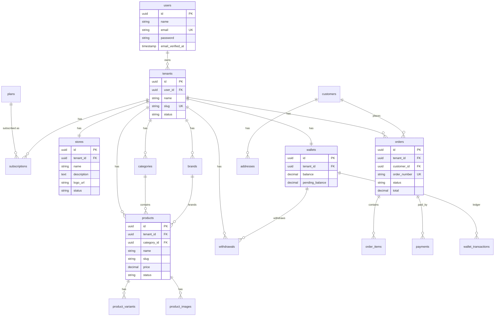

# Database Schema

> ERD + definisi tabel inti SaaS Toko Instan.
> Acuan: [multi-tenant.md](../architecture/multi-tenant.md) · [blueprint.md](../blueprint.md)

**Engine:** PostgreSQL  
**Schemas:** `public` (bisnis), `audit`, `logs`

Semua tabel bisnis punya `tenant_id` kecuali yang ditandai **global**.

---

## ERD (inti MVP)



---

## Konvensi umum

| Konvensi | Nilai |
|----------|-------|
| Primary key | `uuid` (atau `bigint` — pilih satu di migrasi; dokumen ini pakai uuid) |
| Timestamps | `created_at`, `updated_at` |
| Soft delete | `deleted_at` pada products, orders (opsional customers) |
| Money | `bigint` dalam **sen/rupiah penuh** (integer) **atau** `decimal(15,2)` — pilih satu; rekomendasi MVP: `bigint` (Rupiah tanpa desimal) |
| Index wajib | `(tenant_id)`, unique composite di mana perlu |

---

## Tabel global (tanpa tenant_id)

### `users`

| Kolom | Tipe | Keterangan |
|-------|------|------------|
| id | uuid PK | |
| name | string | |
| email | string UNIQUE | |
| password | string | hashed |
| email_verified_at | timestamp NULL | |
| role | string | `seller`, `admin` (platform) |
| remember_token | string NULL | |
| created_at / updated_at | timestamp | |

### `plans`

| Kolom | Tipe | Keterangan |
|-------|------|------------|
| id | uuid PK | |
| code | string UNIQUE | `free`, `premium` |
| name | string | |
| price | bigint | Rp99.000 untuk premium (bulan) |
| withdraw_fee | bigint | 5000 free, 0 premium |
| settlement_mode | string | `escrow` / `direct` |
| features | json NULL | feature flags |
| is_active | boolean | |

---

## Tenant & store

### `tenants`

| Kolom | Tipe | Keterangan |
|-------|------|------------|
| id | uuid PK | |
| user_id | uuid FK → users | owner |
| name | string | |
| slug | string UNIQUE | subdomain |
| status | string | `active`, `inactive`, `suspended` |
| plan_code | string | denormalized current plan (`free`/`premium`) |
| created_at / updated_at | timestamp | |

**Index:** `slug` UNIQUE, `user_id`

### `stores`

| Kolom | Tipe | Keterangan |
|-------|------|------------|
| id | uuid PK | |
| tenant_id | uuid FK UNIQUE | 1:1 dengan tenant |
| name | string | |
| description | text NULL | |
| logo_url | string NULL | CDN URL |
| contact_email | string NULL | |
| contact_phone | string NULL | |
| custom_domain | string NULL UNIQUE | Phase 3 |
| status | string | `active`, `inactive` |
| created_at / updated_at | timestamp | |

**Index:** `tenant_id` UNIQUE

### `subscriptions`

| Kolom | Tipe | Keterangan |
|-------|------|------------|
| id | uuid PK | |
| tenant_id | uuid FK | |
| plan_id | uuid FK → plans | |
| status | string | `active`, `expired`, `cancelled` |
| starts_at | timestamp | |
| ends_at | timestamp NULL | |
| created_at / updated_at | timestamp | |

**Index:** `(tenant_id, status)`

---

## Catalog

### `categories`

| Kolom | Tipe | Keterangan |
|-------|------|------------|
| id | uuid PK | |
| tenant_id | uuid FK | |
| name | string | |
| slug | string | unique per tenant |
| parent_id | uuid NULL FK | nested opsional |
| created_at / updated_at | timestamp | |

**Index:** UNIQUE `(tenant_id, slug)`, `tenant_id`

### `brands`

| Kolom | Tipe | Keterangan |
|-------|------|------------|
| id | uuid PK | |
| tenant_id | uuid FK | |
| name | string | |
| slug | string | unique per tenant |
| created_at / updated_at | timestamp | |

**Index:** UNIQUE `(tenant_id, slug)`

### `products`

| Kolom | Tipe | Keterangan |
|-------|------|------------|
| id | uuid PK | |
| tenant_id | uuid FK | |
| category_id | uuid NULL FK | |
| brand_id | uuid NULL FK | |
| name | string | |
| slug | string | unique per tenant |
| description | text NULL | |
| type | string | `physical`, `digital` |
| price | bigint | harga dasar (jika tanpa variant) |
| status | string | `draft`, `published`, `archived` |
| weight | int NULL | gram |
| deleted_at | timestamp NULL | |
| created_at / updated_at | timestamp | |

**Index:** UNIQUE `(tenant_id, slug)`, `(tenant_id, status)`

### `product_variants`

| Kolom | Tipe | Keterangan |
|-------|------|------------|
| id | uuid PK | |
| tenant_id | uuid FK | |
| product_id | uuid FK | |
| sku | string | unique per tenant |
| name | string | mis. "Merah / L" |
| price | bigint | |
| stock | int | |
| barcode | string NULL | |
| created_at / updated_at | timestamp | |

**Index:** UNIQUE `(tenant_id, sku)`, `product_id`

### `product_images`

| Kolom | Tipe | Keterangan |
|-------|------|------------|
| id | uuid PK | |
| tenant_id | uuid FK | |
| product_id | uuid FK | |
| object_key | string | path di R2 |
| cdn_url | string | URL publik (biasanya large/medium) |
| urls | json | `{ thumbnail, medium, large }` |
| mime_type | string | |
| size | int | bytes original |
| sort_order | int | |
| created_at / updated_at | timestamp | |

**Index:** `(tenant_id, product_id)`

---

## Customer & cart

### `customers`

Buyer per toko (bisa linked ke `users` atau guest email).

| Kolom | Tipe | Keterangan |
|-------|------|------------|
| id | uuid PK | |
| tenant_id | uuid FK | |
| user_id | uuid NULL FK | jika unified account |
| name | string | |
| email | string | |
| phone | string NULL | |
| created_at / updated_at | timestamp | |

**Index:** UNIQUE `(tenant_id, email)`

### `addresses`

| Kolom | Tipe | Keterangan |
|-------|------|------------|
| id | uuid PK | |
| tenant_id | uuid FK | |
| customer_id | uuid FK | |
| label | string NULL | Rumah / Kantor |
| recipient_name | string | |
| phone | string | |
| address_line | text | |
| city | string | |
| province | string | |
| postal_code | string | |
| is_default | boolean | |
| created_at / updated_at | timestamp | |

### `carts` / `cart_items` (ringkas)

- `carts`: tenant_id, customer_id / session_id
- `cart_items`: cart_id, product_variant_id, qty, price_snapshot

---

## Order & payment

### `orders`

| Kolom | Tipe | Keterangan |
|-------|------|------------|
| id | uuid PK | |
| tenant_id | uuid FK | |
| customer_id | uuid FK | |
| order_number | string UNIQUE | global unique |
| status | string | Pending, Paid, Processing, Packed, Shipped, Completed, Cancelled, Refund |
| subtotal | bigint | |
| discount | bigint | default 0 |
| shipping_cost | bigint | default 0 |
| tax | bigint | default 0 |
| total | bigint | |
| notes | text NULL | |
| shipping_address | json | snapshot alamat |
| paid_at | timestamp NULL | |
| completed_at | timestamp NULL | |
| deleted_at | timestamp NULL | |
| created_at / updated_at | timestamp | |

**Index:** UNIQUE `order_number`, `(tenant_id, status)`, `(tenant_id, created_at)`

### `order_items`

| Kolom | Tipe | Keterangan |
|-------|------|------------|
| id | uuid PK | |
| tenant_id | uuid FK | |
| order_id | uuid FK | |
| product_id | uuid FK | |
| product_variant_id | uuid NULL FK | |
| name | string | snapshot |
| sku | string NULL | snapshot |
| price | bigint | snapshot |
| qty | int | |
| total | bigint | |

### `payments`

| Kolom | Tipe | Keterangan |
|-------|------|------------|
| id | uuid PK | |
| tenant_id | uuid FK | |
| order_id | uuid FK | |
| provider | string | midtrans, manual, cod |
| method | string | va, qris, ewallet, transfer, cod |
| amount | bigint | |
| status | string | pending, paid, failed, expired |
| external_id | string NULL | ID gateway |
| idempotency_key | string UNIQUE | |
| payload | json NULL | raw webhook / response |
| paid_at | timestamp NULL | |
| created_at / updated_at | timestamp | |

**Index:** UNIQUE `idempotency_key`, `(order_id)`, `(external_id)`

---

## Wallet & withdraw

### `wallets`

Satu wallet per tenant.

| Kolom | Tipe | Keterangan |
|-------|------|------------|
| id | uuid PK | |
| tenant_id | uuid FK UNIQUE | |
| balance | bigint | available |
| pending_balance | bigint | escrow belum available |
| currency | string | `IDR` |
| created_at / updated_at | timestamp | |

### `wallet_transactions` (ledger immutable)

| Kolom | Tipe | Keterangan |
|-------|------|------------|
| id | uuid PK | |
| tenant_id | uuid FK | |
| wallet_id | uuid FK | |
| type | string | lihat money-flow |
| direction | string | `credit` / `debit` |
| amount | bigint | selalu positif |
| balance_after | bigint | snapshot available |
| pending_after | bigint | snapshot pending |
| reference_type | string NULL | Order, Withdrawal, Payment |
| reference_id | uuid NULL | |
| description | string NULL | |
| created_at | timestamp | **no update** |

**Index:** `(wallet_id, created_at)`, `(tenant_id)`, `(reference_type, reference_id)`

### `withdrawals`

| Kolom | Tipe | Keterangan |
|-------|------|------------|
| id | uuid PK | |
| tenant_id | uuid FK | |
| wallet_id | uuid FK | |
| amount | bigint | diminta seller |
| fee | bigint | 5000 free / 0 premium |
| net_amount | bigint | amount - fee |
| status | string | Pending, Approved, Rejected, Transferred |
| bank_name | string | |
| bank_account | string | |
| account_holder | string | |
| approved_at | timestamp NULL | |
| transferred_at | timestamp NULL | |
| rejected_reason | text NULL | |
| created_at / updated_at | timestamp | |

**Index:** `(tenant_id, status)`

---

## Schema `audit` & `logs`

### `audit.activity_logs` (konsep Phase 3, siapkan schema dari awal)

| Kolom | Keterangan |
|-------|------------|
| id, tenant_id NULL, user_id, action, subject_type, subject_id, properties json, ip, created_at | |

### `logs.*`

Application / job failure logs jika dipisah dari default Laravel log file (opsional).

---

## Relasi ringkas

```
users → tenants → stores
                → products → variants / images
                → orders → items / payments
                → wallets → wallet_transactions / withdrawals
                → subscriptions → plans
```

---

## Checklist migrasi (Phase 0–1)

1. users, plans  
2. tenants, stores, subscriptions  
3. categories, brands, products, variants, images  
4. customers, addresses, carts  
5. orders, order_items, payments  
6. wallets, wallet_transactions, withdrawals  

Detail alur uang: [money-flow.md](../architecture/money-flow.md)  
Media: [cdn-media.md](../architecture/cdn-media.md)
